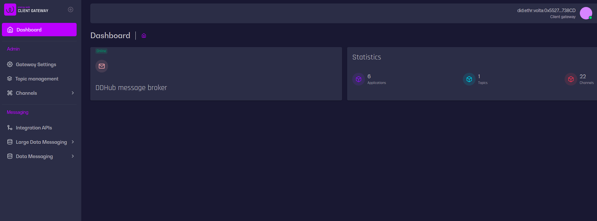

# DDHUB Client Gateway

DDHUB Client Gateway is a set of applications to communicate with [DDHUB Message Broker](https://github.com/energywebfoundation/ddhub-message-broker).  
This repository contains several applications.

### Frontend


This application allows us to configure client gateway backend

### API

Communicates directly with message broker for topics, messaging etc.

### Scheduler

Retrieves and caches data for performance purposes

## Environment variables

[API](docs/api-variables.md)  
[Frontend](docs/frontend-variables.md)
## How to run

After configuring environment variables (in `.env` file) run following commands

### Development mode

```shell
$ npm ci

$ nx serve dsb-client-gateway-scheduler
$ nx serve dsb-client-gateway-api
$ nx serve dsb-client-gateway-frontend
```

### Production mode

```shell
$ npm ci

$ nx build dsb-client-gateway-scheduler
$ nx build dsb-client-gateway-api

$ node dist/apps/dsb-client-gateway-api/main.js
$ node dist/apps/dsb-client-gateway-scheduler/main.js
```

Running pure `node` in production is not recommended. Use any process manager (pm2, docker etc.) for stability.  
You can find docker images in `ci` directory.

## How to run with containers
### Start with docker-composer in local environment
```
cd get-started && docker-compose up
```
Once all the servers are up and running. please follow below steps
  - create secret path 'dsb'
    * open a browser visit http://localhost:8200, type in token 'root'
    * Press `Enable new engine` , select `KV` and press 'Next' , in the path input type `dsb` , press on Method options and select Version to be `v1` and press Enable engine
  - ddhub-clientgateway should be accessbile at http://localhost:3009, api docs at http://localhost:3009/docs

### Start with kubernetes by using helm chart manually

To run the ddhub-gateway stack on a kubernetes cluster. make sure you have `helm` installed, and `kubectl` configurated for accessing the cluster.
before start running any deployment, created a namespace 'ddhub-gateway' for the deployment (optional)
```
kubectl create namespace ddhub-gateway
```
##### 1, Deploy vault secret engine
```
helm repo add hashicorp https://helm.releases.hashicorp.com
helm install vault hashicorp/vault --namespace ddhub-gateway
```
once all the servers for vault are running, run command `kubectl port-forward service/vault 8200:8200 -n ddhub-gateway` then follow: 
  - Open your browser at http://localhost:8200 and then follow this [guide](https://learn.hashicorp.com/tutorials/vault/getting-started-ui?in=vault/getting-started) jump and start from step 5 
  - create secret path 'dsb'
    * open a browser visit http://localhost:8200, type in token, value for 'root_token' from the json file you downloaded from step one,
    * Press `Enable new engine` , select `KV` and press 'Next' , in the path input type `dsb` , press on Method options and select Version to be `v1` and press Enable engine

##### 2, Deploy ddhub-gateway

add ewf helm repo
```
helm repo add ewf https://aemocontainerregistry.azurecr.io/helm/v1/repo
```
 please update value files at path `/get-started/helm-values` . replace CAPTIALIZED placehoders.

    - put in vault token (from above step downloaded json file) in `/get-started/helm-values/vault-secret.yaml`,
    - ingress in both value files are disabled, you ll need to put in your hostname before you enable it.

Created kubernetes secret for storing `VAULT_TOKEN`, and deploy ddhub-gateway   
 ```
kubectl apply -f /get-started/helm-values/vault-secret.yaml -n ddhub-gateway

helm install ddhub-gateway-demo -f /get-started/helm-values/frontend-values.yaml -f /get-started/helm-values/values.yaml ewf/ddhub-client-gateway-api -n ddhub-gateway
```

Check all the pods by running `kubectl get pods -n ddhub-gateway`, once they are all running, you should be able to visit your hostname to access the ddhub-gateway.

## Swagger
Swagger is available on route `{{API_HOST}}/docs`.    
Postman collection to import is available under `${{API_HOST}}/docs-json`

## Helpful links

- [HELM](https://github.com/energywebfoundation/dsb-client-gateway-helm)
- [Message Broker](https://github.com/energywebfoundation/ddhub-message-broker)

## Contributing
Pull requests are welcome. For major changes, please open an issue first to discuss what you would like to change.

Please make sure to update tests as appropriate.

## License
[MIT](https://choosealicense.com/licenses/mit/)
